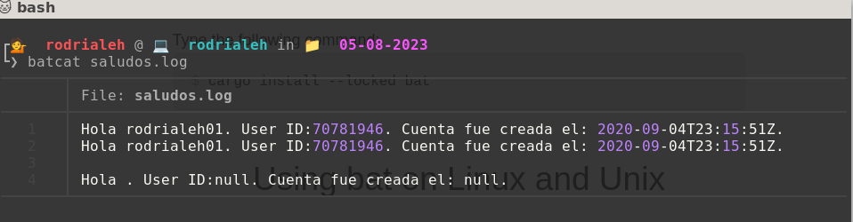
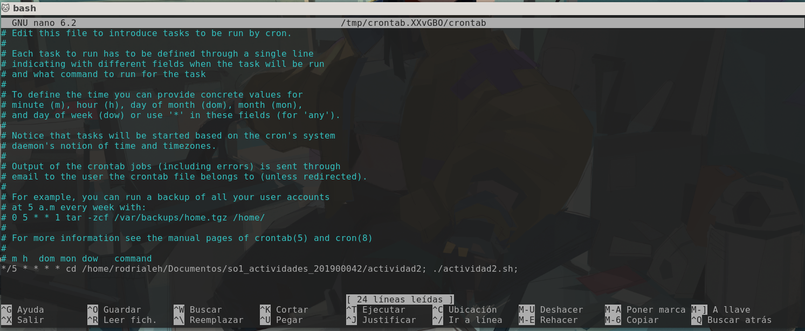
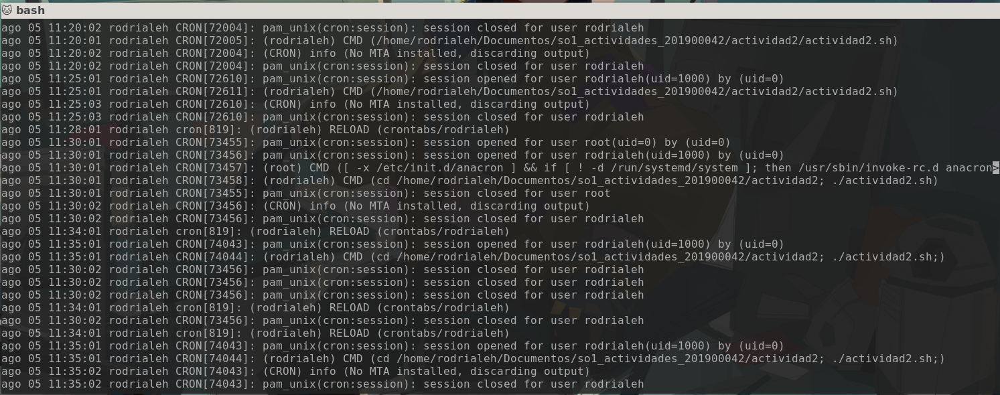

# Actividad 2

|Nombre|Carnet|
|------|------|
|Rodrigo Alejandro Hernández de León|201900042|

## 👨‍💻 Scripting

Se presenta el siguiente script el cual realiza lo siguiente:

- Lee el username de github y guardarlo en la variable de GITHUB_USER

- Consulta la url `https://api.github.com/users/` concatenando el valor de la variable GITHUB_USER al final

- Imprime el mensaje
    ```bash
    Hola <github_user>. User ID: <id>. Cuenta fue creada el: <created_at>.
    ```

- Crea un log file en `/tmp/<fecha>/saludos.log` con la salida del mensaje anterior. Donde `<fecha>` corresponde a la fecha del dia de ejecución del script.

### 🗒 Script

Se puede encontrar el archivo en [Script](./actividad2.sh)

```bash
#Pide el nombre de usuario de github y la lee
echo "Ingrese su username de github:"
#GITHUB_USER="rodrialeh01"
read GITHUB_USER

#Se crea la variable de la url de la api de github
URL="https://api.github.com/users/${GITHUB_USER}"

#Se crea la variable del user_id, que es el id del usuario de github
user_id=$(curl -s $URL | jq -r '.id')

#Se crea la variable del created_at, que es la fecha de creacion de la cuenta de github
created_at=$(curl -s $URL| jq -r '.created_at')

#Se crea la variable del saludo, que es el mensaje que se mostrara en la shell
saludo="Hola $GITHUB_USER. User ID:${user_id}. Cuenta fue creada el: ${created_at}."

#muestra el saludo
echo $saludo

#obitnene la fecha actual
fecha=$(date +"%d-%m-%Y")

#crea la carpeta de la fecha
mkdir -p "/tmp/$fecha"

#crea y escribe el saludo en saludos.log
echo $saludo >>"/tmp/$fecha/saludos.log"
```

### 📷 Log file luego de la ejecución del script



## ⏱ Cronjob

Se crea un cronjob para que el script anterior se ejecute a cada 5 minutos.

### 🗒 Crontab

Se agrego lo siguiente al crontab:

```bash
*/5 * * * * cd /home/rodrialeh/Documentos/so1_actividades_201900042/actividad2; ./actividad2.sh;
```

Mostrando lo siguiente:



### 📷 Registro de los logs del CRON



