# Actividad 3

|Nombre|Carnet|
|------|------|
|Rodrigo Alejandro Hernández de León|201900042|

# 👥 Gestión de Permisos

## 1. Gestión de Usuarios

- ### 📝 Creación de usuarios y Asignación de contraseñas

    Crea tres usuarios llamados `usuario1`, `usuario2` y `usuario3`. Establece una nueva contraseña para cada usuario creado.

    ```bash
    sudo adduser usuario1
    sudo adduser usuario2
    sudo adduser usuario3
    ```
    Creación del `usuario1`:

    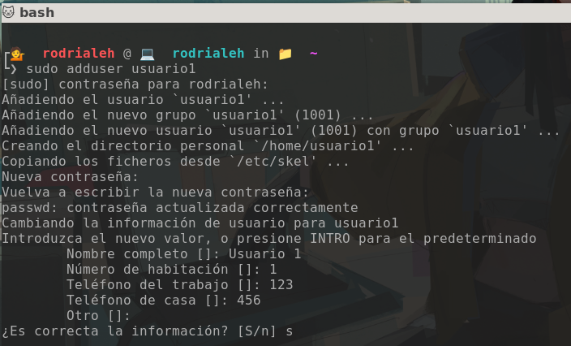

    Creación del `usuario2`:

    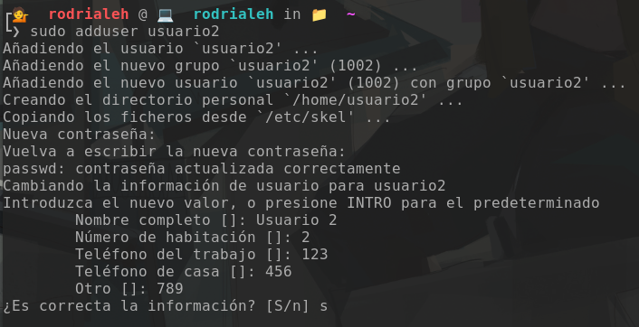

    Creación del `usuario3`:

    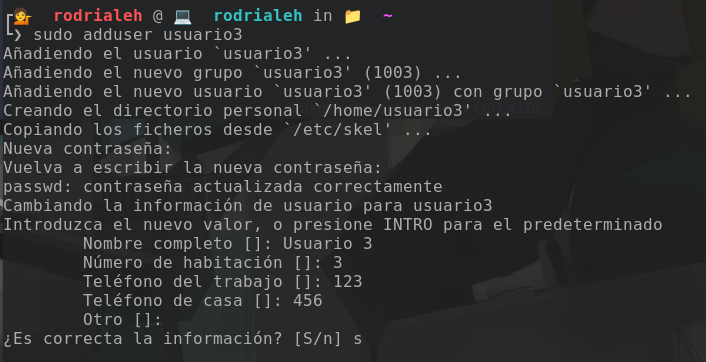

- ### 👥 Información de Usuarios

    Muestra la información de `usuario1` usando el comando `id`.

    ```bash
    id usuario1
    ```

    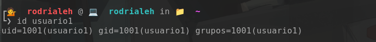

- ### ❌ Eliminación de Usuarios

    Elimina `usuario3`, pero conserva su directorio principal.

    ```bash
    sudo deluser usuario3
    ```

    Eliminación del `usuario3`:

    

    El directorio del `usuario3` se conserva (`/home/usuario3`):

    

## 2. 👥 Gestión de Grupos

- ### 📝 Creación de Grupos

    Crea un grupo llamado `grupo1` y `grupo2`.

    ```bash
    sudo addgroup grupo1
    sudo addgroup grupo2
    ```

    Creación del `grupo1`:

    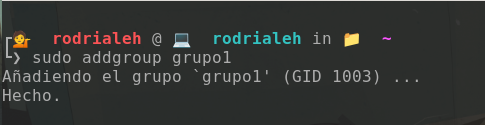

    Creación del `grupo2`:

    

- ### 📝 Agregar Usuarios a Grupos

    Agrega `usuario1` a `grupo1` y `usuario2` a `grupo2`.

    ```bash
    sudo adduser usuario1 grupo1
    sudo adduser usuario2 grupo2
    ```

    Agregando el `usuario1` al `grupo1`:

    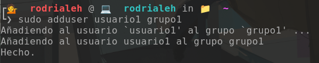

    Agregando el `usuario2` al `grupo2`:

    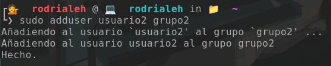

- ### 📋 Verificar Membresía

    Verifica que los usuarios han sido agregados a los grupos utilizando el comando `groups`.

    ```bash
    groups usuario1
    groups usuario2
    ```

    Verificando la membresía del `usuario1`:

    

    Verificando la membresía del `usuario2`:

    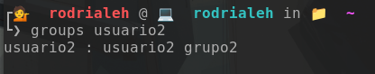

- ### ❌ Eliminar Grupo

    Elimina `grupo2`.

    ```bash
    sudo delgroup grupo2
    ```

    Eliminación del `grupo2`:

    

## 3. 🔐 Gestión de Permisos

- ### 📝 Creación de Archivos y Directorios

    - Como `usuario1`, crea un archivo llamado `archivo1.txt` en su directorio principal y escribe algo en él.

        ```bash
        su usuario1
        echo "Aqui escribo el contenido del archivo desde el usuario1" >> ./archivo1.txt
        ```

        Creación del `archivo1.txt`:

        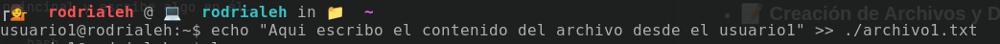

        Verificando el contenido del `archivo1.txt`:

        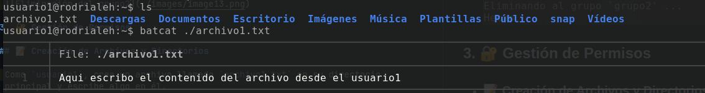

    - Crea un directorio llamado `directorio1` y dentro de ese directorio, un archivo llamado `archivo2.txt`.

        ```bash
        mkdir directorio1
        cd directorio1
        touch archivo2.txt
        ```

        Creación del `directorio1` y `archivo2.txt`:

        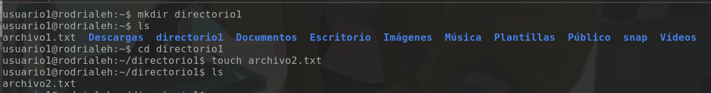

- ### 📋 Verificar Permisos

    Verifica los permisos del archivo y directorio usando el comando `ls -l` y `ls -ld` respectivamente.

    ```bash
    ls -l archivo1.txt
    ls -ld directorio1
    ls -l ./directorio1/archivo2.txt
    ```

    Verificando los permisos del `archivo1.txt`:

    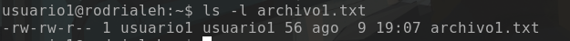

    Verificando los permisos del `directorio1`:

    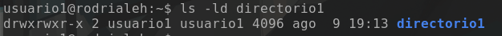

    Verificando los permisos del `archivo2.txt`:

    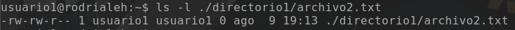

- ### 📝 Modificar Permisos usando `chmod` con Modo Numérico

    Cambia los permisos del `archivo1.txt` para que sólo `usuario1` pueda leer y escribir (permisos `rw-`), el grupo pueda leer (permisos `r--`) y nadie más pueda hacer nada.

    ```bash
    chmod 640 archivo1.txt
    ```

    Cambiando los permisos del `archivo1.txt`:

    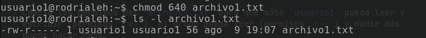

- ### 📝 Modificar Permisos usando `chmod` con Modo Simbólico

    Agrega permiso de ejecución al propietario del `archivo2.txt`.

    ```bash
    chmod u+x archivo2.txt
    ```

    Agregando permiso de ejecución al propietario del `archivo2.txt`:

    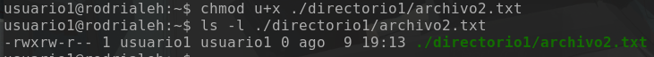

- ### 📝 Cambiar el Grupo Propietario

    Cambia el grupo propietario de `archivo2.txt` a `grupo1`.

    ```bash
    chgrp grupo1 archivo2.txt
    ```

    Cambiando el grupo propietario del `archivo2.txt`:

    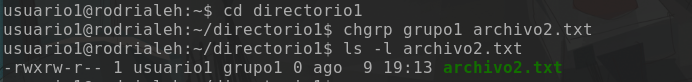

- ### 📝 Configurar Permisos de Directorio

    Cambia los permisos del `directorio1` para que sólo el propietario pueda entrar (permisos `rwx`), el grupo pueda listar contenidos pero no entrar (permisos `r--`), y otros no puedan hacer nada.

    ```bash
    chmod 740 directorio1
    ```

    Cambiando los permisos del `directorio1`:

    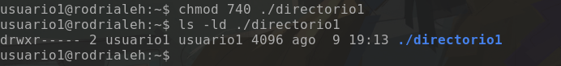

- ### 🔰 Comprobación de Acceso

    Intenta acceder al `archivo1.txt` y `directorio1/archivo2.txt` como `usuario2`. Nota cómo el permiso de directorio afecta el acceso a los archivos dentro de él.

    - Intento del `usuario2` de acceder al `archivo1.txt`:

        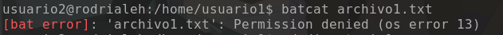

    - Intento del `usuario2` de acceder al `directorio1/archivo2.txt`:

        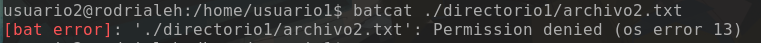

- ### 📋 Verificación Final

    Verifica los permisos y propietario de los archivos y directorio nuevamente con `ls -l` y `ls -ld`.

    ```bash
    ls -l archivo1.txt
    ls -ld directorio1
    ls -l ./directorio1/archivo2.txt
    ```

    - Verificando los permisos y propietario del `archivo1.txt`:

        

    - Verificando los permisos y propietario del `directorio1`:

        

    - Verificando los permisos y propietario del `archivo2.txt`:

        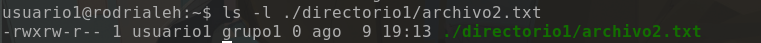

## 🤓 Reflexión

- ### 🤔 ¿Por qué es importante gestionar correctamente los usuarios y permisos en un sistema operativo?

    Porque dentro de un sistema operativo existen diferentes usuarios y cada uno de ellos tiene diferentes permisos, por lo que es importante gestionarlos correctamente para que cada usuario tenga los permisos que le fueron asignados para poder realizar sus tareas y no acceder a información que no se le permita dentro de sus permisos asignados.

- ### 🤔 ¿Qué otros comandos o técnicas conocen para gestionar permisos en Linux?

    ```bash
    chown # Cambia el propietario y el grupo de los archivos y directorios.
    ```