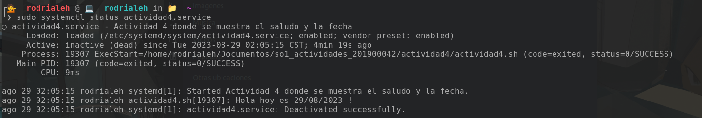
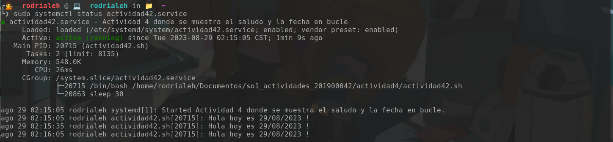

# Actividad 4

|Nombre|Carnet|
|------|------|
|Rodrigo Alejandro Hernández de León|201900042|

# 🗒 Systemd Unit

Crear un systemd unit de tipo servicio para ejecutar un script imprima un saludo y la fecha actual. 

## 🗒 Script Nivel 1

```bash
#!/bin/bash

echo "Hola hoy es $(date +"%d/%m/%Y") !"
```

### Pasos para ejecutar el servicio:

1. Al archivo `actividad4` hay que darle los permisos de ejecución:

```bash
chmod +x actividad4.sh
```

2. Luego se debe crear el archivo `actividad4.service` en la carpeta `/etc/systemd/system/` con el siguiente contenido:

```bash
[Unit]
Description=Actividad 4 donde se muestra el saludo y la fecha

[Service]
Type=simple
ExecStart=/home/rodrialeh/Documentos/so1_actividades_201900042/actividad4/actividad4.sh

[Install]
WantedBy=multi-user.target
```

3. Ya teniendo el servicio, se debe de habilitar el servicio con el siguiente comando:

```bash
sudo systemctl enable actividad4.service
```

4. Luego se debe de iniciar el servicio con el siguiente comando:

```bash
sudo systemctl start actividad4.service
```

5. Verificar que el servicio se este ejecutando con el siguiente comando:

```bash
sudo systemctl status actividad4.service
```



## 🗒 Script Nivel 2

```bash
#!/bin/bash

while true; do
    echo "Hola hoy es $(date +"%d/%m/%Y") !"
    sleep 30 # Intervalo de 30 segundos
done
```

### Pasos para ejecutar el servicio:

1. Al archivo `actividad42` hay que darle los permisos de ejecución:

```bash
chmod +x actividad42.sh
```

2. Luego se debe crear el archivo `actividad42.service` en la carpeta `/etc/systemd/system/` con el siguiente contenido:

```bash
[Unit]
Description=Actividad 4 donde se muestra el saludo y la fecha en bucle

[Service]
Type=simple
ExecStart=/home/rodrialeh/Documentos/so1_actividades_201900042/actividad4/actividad42.sh

[Install]
WantedBy=multi-user.target
```

3. Ya teniendo el servicio, se debe de habilitar el servicio con el siguiente comando:

```bash
sudo systemctl enable actividad42.service
```

4. Luego se debe de iniciar el servicio con el siguiente comando:

```bash
sudo systemctl start actividad42.service
```

5. Verificar que el servicio se este ejecutando con el siguiente comando:

```bash
sudo systemctl status actividad42.service
```


Como se puede apreciar, se ejecuta cada 30 segundos